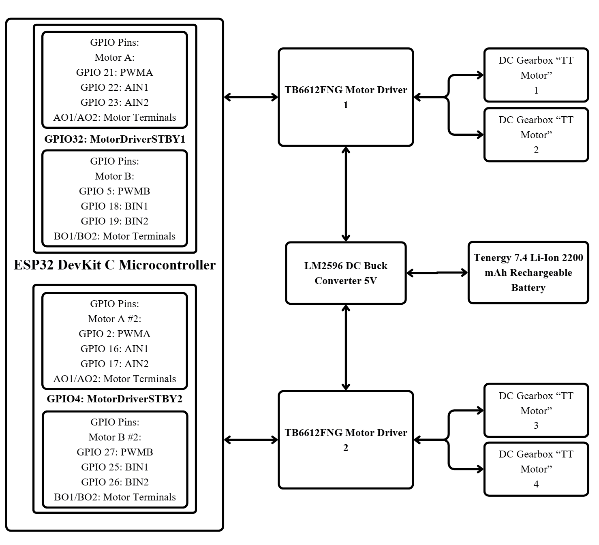
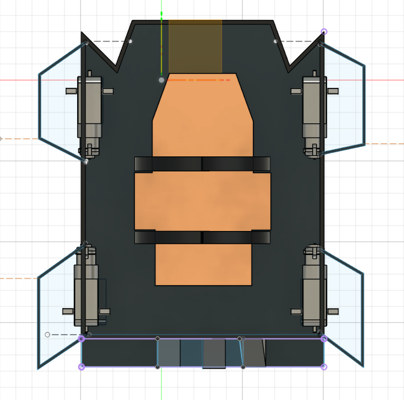
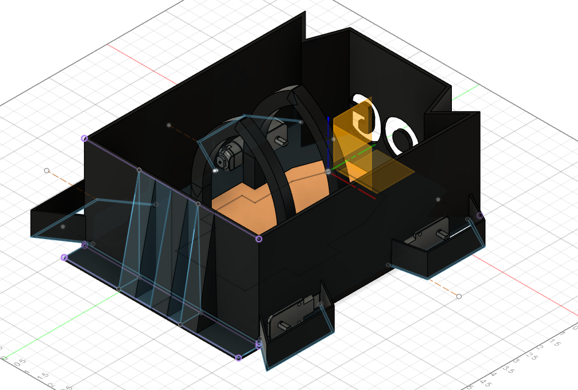
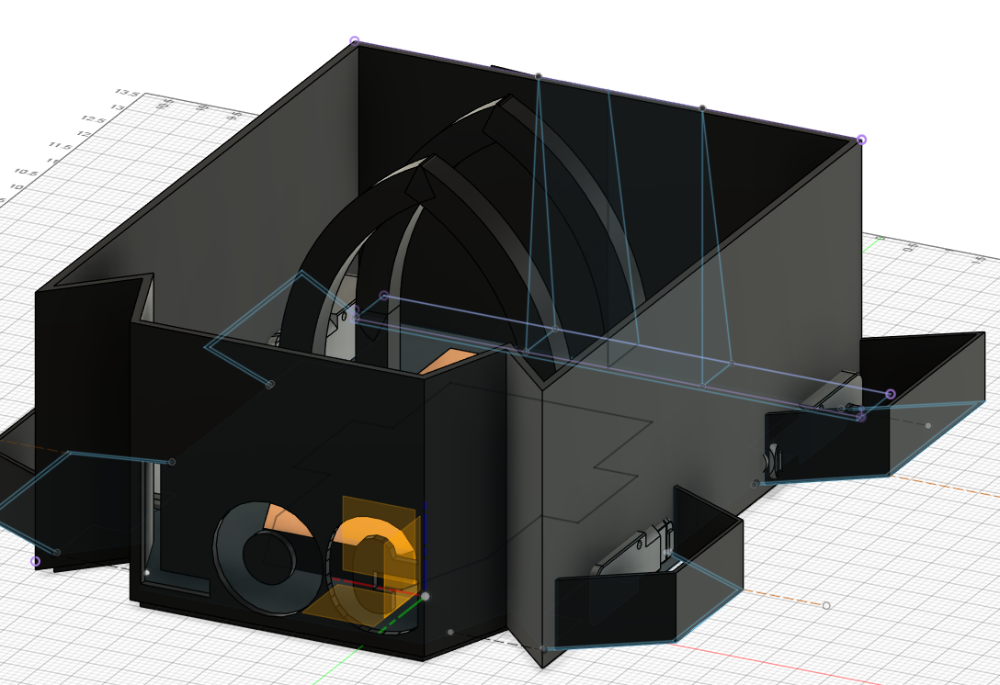
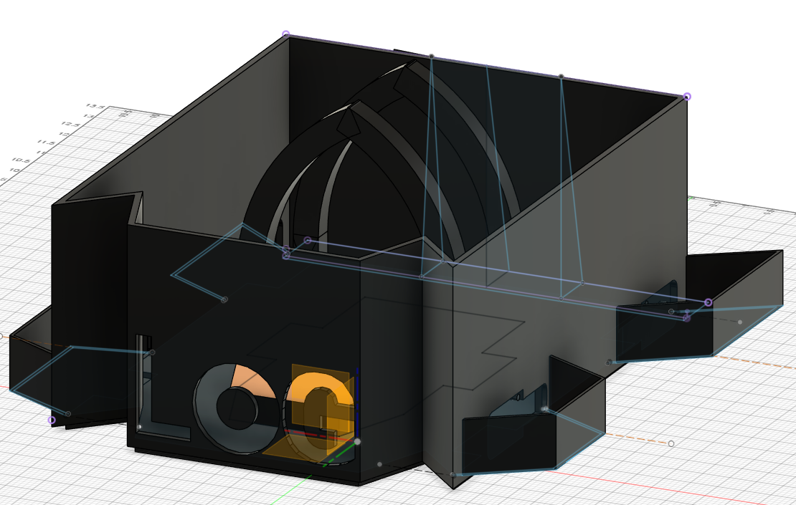
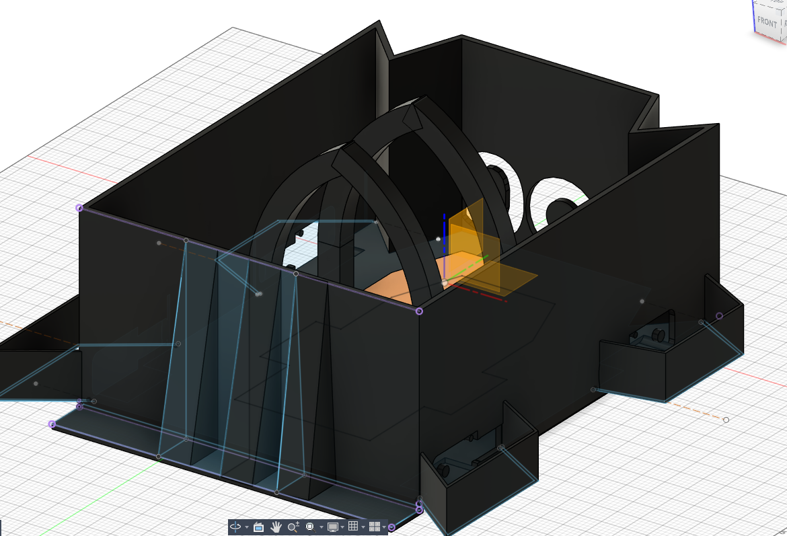
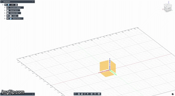

# Introduction
---
This repository contains the project files for **LOG (Lethal Offensive Gear)**, a mobile robotics project developed for the **Fall 2025 ECE 528: Robotics and Embedded Systems** course. The goal of the project was to design, build, and program a functional robotic platform using embedded systems principles.

**Performed By:**
- Antonio Anzora Jr  
- Vartan Charkyan  

**Professor:**
- Aaron Nanas  

# Description
---
LOG is an ESP32–WROOM–32E–based robotic system featuring four DC motor gearboxes, motor drivers, regulated power delivery, and a custom-designed Fusion 360 chassis. The project includes firmware, VS Code configuration files, hardware documentation, and mechanical design resources. Detailed component specifications are provided in the hardware table below.

# Block Diagram
---

# Components Used
---
| Description | Quantity | Manufacturer | Price ($) | Link |
|------------|----------|--------------|-----------|------|
| ESP32-WROOM-32E 4MB Flash | 1 | Espressif Systems | 10.00 per unit | [Product Link](https://www.digikey.com/en/products/detail/espressif-systems/ESP32-DEVKITC-32E/12091810) |
| Micro:Bit USB Cable 300mm Black | 1 | SparkFun Electronics | 3.67 per unit | [Product Link](https://www.digikey.com/en/products/detail/sparkfun-electronics/CAB-24508/22321088) |
| TB6612FNG Motor Driver | 2 | SparkFun Electronics | 14.50 per unit | [Product Link](https://www.digikey.com/en/products/detail/sparkfun-electronics/14450/7915576) |
| DC Gearbox Motor “TT Motor” 200RPM 3–6V | 4 | Adafruit | 2.95 per unit | [Product Link](https://www.adafruit.com/product/3777) |
| TT Motor Wheels (Orange/Clear) | 4 | Adafruit | 1.50 per unit | [Product Link](https://www.adafruit.com/product/3766#description) |
| DC Buck Converter | 10 | SparkFun | 12.99 per pack | [Product Link](https://www.amazon.com/dp/B07VVXF7YX) |
| Tenergy 7.4V Li-Ion 2200mAh Battery | 1 | Tenergy | 16.99 per unit | [Product Link](https://www.amazon.com/dp/B002Y2LJW0) |
| Tenergy 7.4V Battery Charger | 1 | Tenergy | 23.99 per unit | [Product Link](https://www.amazon.com/dp/B007MD54NQ) |

# CAD & 3D Printed Model
---

  
  
<em>Top view of the chassis showing motor placement</em>

  
  
<em>Rear view of the chassis with motors installed, showing gear alignment</em>

  
  
<em>Front view of the chassis with motors installed, highlighting wheel mounts</em>

  
  
<em>Front view of the chassis without motors, showing empty mount positions</em>

  
  
<em>Rear view of the chassis without motors, showing open gear compartments</em>

<h2>Fusion 360 Timelapse</h2>

  
  
<em>Timelapse of the chassis design in Fusion 360, showing the build process</em>

