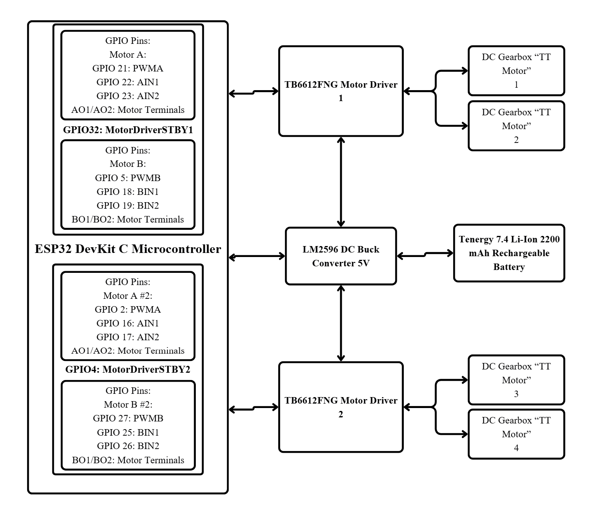
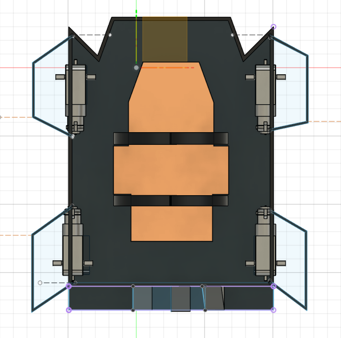
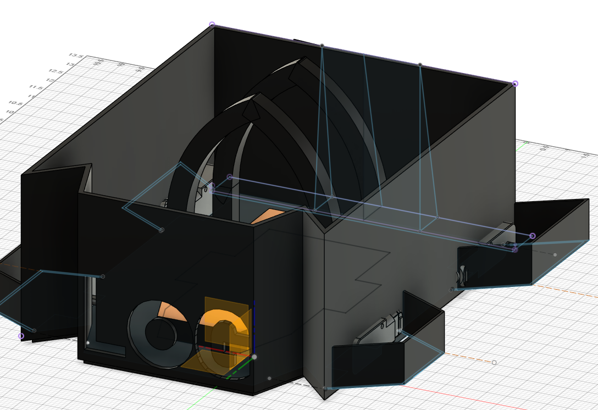
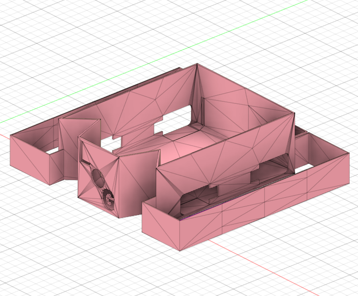
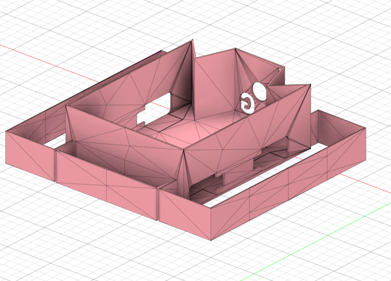

# Introduction
---
This repository contains the project files for **LOG (Lethal Offensive Gear)**, a mobile robotics project developed for the **Fall 2025 ECE 528: Robotics and Embedded Systems** course. The goal of the project was to design, build, and program a functional robotic platform using embedded systems principles.

**Performed By:**
- Antonio Anzora Jr  
- Vartan Chakryan  

**Professor:**
- Aaron Nanas  

# Description
---
LOG is an ESP32–WROOM–32E–based robotic system featuring four DC motor gearboxes, motor drivers, regulated power delivery, and a custom-designed Fusion 360 chassis. The project includes firmware, VS Code configuration files, hardware documentation, and mechanical design resources. Detailed component specifications are provided in the hardware table below.

# Results and Video Demonstration Links
---
The L.O.G. robot successfully achieves its intended functionality. The HTTP local server allows users to select commands such as forward, backwards, left, right, and stop, providing real-time control of the robot. Using a touchscreen laptop makes the interaction even more intuitive compared to mouse clicks, enhancing the user experience. 
- [Video FarUp Demo](https://youtube.com/shorts/Mxwh_CG7am0?feature=share)
- [Google Drive Demos](https://drive.google.com/drive/folders/1Z1n1CEIT03VmvK7F4xq60eIc1RUjuvVK?usp=sharing)
- [Google Drive Photos of Chassis & WebSite on iOS Phone](https://drive.google.com/drive/folders/1Z1n1CEIT03VmvK7F4xq60eIc1RUjuvVK?usp=sharing)
# Background and Methodology
---
The L.O.G. Project utilizes several embedded system concepts. Specifically, the ESP32-WRROM-32E microcontroller is used to host a Wi-Fi HTTP server, enabling control of the robot’s actions. This feature allows real-time user interaction through a web-based interface. By leveraging the microcontroller’s networking capabilities and integrating motor driver with DC motors, we were able to design a system that responds instantly to user commands.
# Block Diagram
---


# Components Used
---
| Description | Quantity | Manufacturer | Price ($) | Link |
|------------|----------|--------------|-----------|------|
| ESP32-WROOM-32E 4MB Flash | 2 | Espressif Systems | 10.00 per unit | [Product Link](https://www.digikey.com/en/products/detail/espressif-systems/ESP32-DEVKITC-32E/12091810) |
| Micro:Bit USB Cable 300mm Black | 1 | SparkFun Electronics | 3.67 per unit | [Product Link](https://www.digikey.com/en/products/detail/sparkfun-electronics/CAB-24508/22321088) |
| TB6612FNG Motor Driver | 3 | SparkFun Electronics | 14.50 per unit | [Product Link](https://www.digikey.com/en/products/detail/sparkfun-electronics/14450/7915576) |
| DC Gearbox Motor “TT Motor” 200RPM 3–6V | 4 | Adafruit | 2.95 per unit | [Product Link](https://www.adafruit.com/product/3777) |
| TT Motor Wheels (Orange/Clear) | 4 | Adafruit | 1.50 per unit | [Product Link](https://www.adafruit.com/product/3766#description) |
| DC Buck Converter | 10 | SparkFun | 12.99 per pack | [Product Link](https://www.amazon.com/dp/B07VVXF7YX) |
| Tenergy 7.4V Li-Ion 2200mAh Battery | 1 | Tenergy | 16.99 per unit | [Product Link](https://www.amazon.com/dp/B002Y2LJW0) |
| Tenergy 7.4V Battery Charger | 1 | Tenergy | 23.99 per unit | [Product Link](https://www.amazon.com/dp/B007MD54NQ) |

# Pinout Table
---
| ESP32 Pin | Connected To | Motor Driver | Motor |
|-----------|--------------|--------------|--------|
| GPIO 22   | AIN1         | TB6612FNG #1 | Motor A |
| GPIO 21   | AIN2         | TB6612FNG #1 | Motor A |
| GPIO 23   | PWMA         | TB6612FNG #1 | Motor A |
| GPIO 19   | BIN1         | TB6612FNG #1 | Motor B |
| GPIO 18   | BIN2         | TB6612FNG #1 | Motor B |
| GPIO 5    | PWMB         | TB6612FNG #1 | Motor B |
| GPIO 32   | STBY         | TB6612FNG #1 | — |
| GPIO 2    | AIN1         | TB6612FNG #2 | Motor C |
| GPIO 16   | AIN2         | TB6612FNG #2 | Motor C |
| GPIO 17   | PWMA         | TB6612FNG #2 | Motor C |
| GPIO 25   | BIN1         | TB6612FNG #2 | Motor D |
| GPIO 26   | BIN2         | TB6612FNG #2 | Motor D |
| GPIO 27   | PWMB         | TB6612FNG #2 | Motor D |
| GPIO 4    | STBY         | TB6612FNG #2 | — |


# CAD & 3D Printed Models
---

### Design 1 – Original Chassis
<div align="center">
  
  <p><em>Top view of the original chassis showing initial motor placement.</em></p>
</div>

<div align="center">
  
  <p><em>Front view of the original chassis with motors installed, highlighting initial gear alignment.</em></p>
</div>

### Design 2 – Mesh Chassis (Optimized)
<div align="center">
  
  <p><em>Front view of the optimized mesh chassis without motors, showing empty mount positions for reference.</em></p>
</div>

<div align="center">
  
  <p><em>Rear view of the optimized mesh chassis without motors, showing empty mount positions for reference.</em></p>
</div>

### Design 1 – Fusion 360 Timelapse
<div align="center">
  
  <p><em>Timelapse of the original chassis design process in Fusion 360.</em></p>
</div>

### Design 2 – Fusion 360 Timelapse
<div align="center">
  
  <p><em>Timelapse of the optimized mesh chassis design process in Fusion 360.</em></p>
</div>

## Uploading the File System (SPIFFS) to the ESP32
To display the CSUN logo and the custom background image on the web interface, the image files were added to the ESP32’s SPIFFS file system. The file system image was then uploaded to the ESP32 using PlatformIO’s “Upload File System Image” tool. This ensures that the web server can load and display the assets locally.

## Flow Summary (How to Use the System)
1. Upload the main ESP32 code using USB through PlatformIO.  
2. Disconnect the USB and power the ESP32 using the 5V output from the DC-DC converter.  
3. Once powered, the ESP32 creates its own Wi-Fi network.  
4. On your device (Laptop, iOS, Android, etc.):  
   - Open Settings → Wi-Fi 
   - Look for a network named `LOG`
   - Enter the provided password  
5. After connecting to the `LOG` network, open a web browser and go to:  
   http://192.168.4.1  
6. The ESP32 Web UI will load.  
7. Press the control buttons (Forward, Left, Right, Backward, Stop) to operate the robot in real time.  
   - Touchscreen devices (phones/tablets/laptops) provide the most intuitive control experience.
## Development Environment
This project uses the PlatformIO extension in VS Code with the Arduino C++ framework for ESP32 development. Below are the key steps and commands used during development:

### Setup ESP32 Environment
- Install PlatformIO in VS Code.
- Connect the ESP32 via USB.
- Select the correct board: `rymcu-esp32-devkitc`.

### Build & Upload Firmware
```bash
pio run --target upload      # Compile and upload to ESP32
pio run --target clean       # Clean build artifacts
pio run --target build       # Compile only, no upload'

